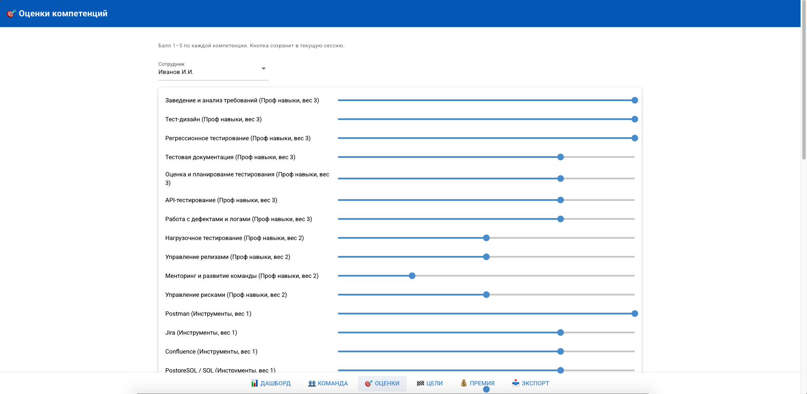
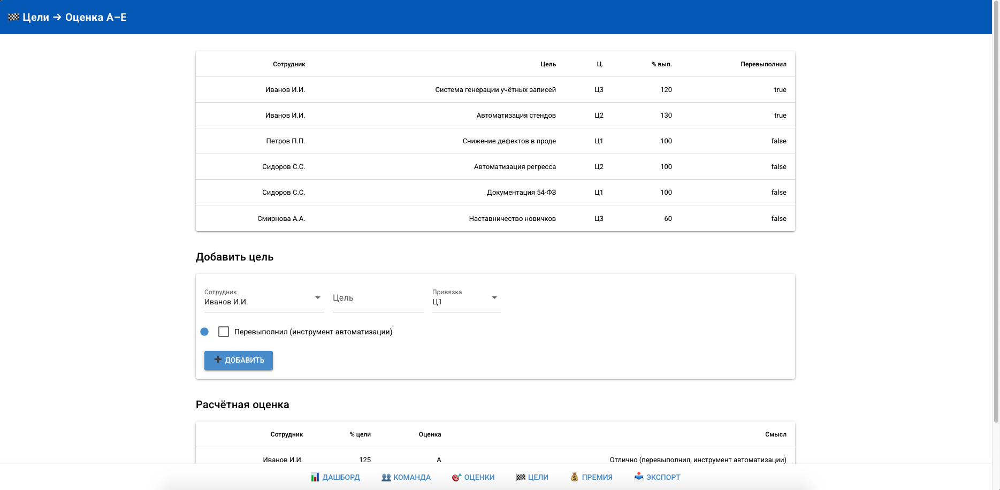
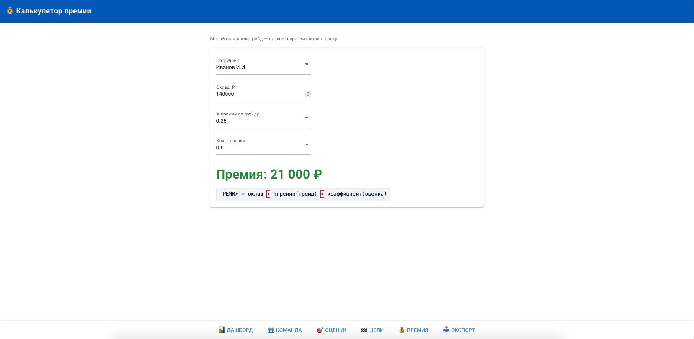

# QA Lead Portfolio

> QA Lead с 12+ годами опыта в тестировании и 6+ годами управления командами до 12 человек (Manual + Automation).
> Строю процессы QA с нуля, внедряю метрики качества и делаю качество прозрачным для бизнеса.
> Домены: финтех (платежи, клиринг, ценные бумаги), телеком, мобильные продукты, AI/LLM-сервисы.
> Практикующий лид: лично тестирую функционал, API и БД, пишу чек-листы и оформляю баг-репорты — примеры в разделе «Практические артефакты».

💬 Telegram: [@GrafZavadskiy](https://t.me/GrafZavadskiy) · 💻 GitHub: [D1ma665](https://github.com/D1ma665)

[](https://qa-grading-app.onrender.com)

**👉 [Открыть интерактивное демо](https://qa-grading-app.onrender.com)**

> ⚠️ Демо на бесплатном тарифе: первый заход ~30–50 сек (инстанс просыпается).

---

## Навигация

| Раздел | Что внутри |
|---|---|
| [Кейсы процессов](#-кейсы-процессов) | 5 кейсов в формате «проблема → действия → результат» |
| [Артефакты](#-артефакты-и-шаблоны) | Обезличенные таблицы, шаблон DoD, чек-лист и образец баг-репортов |
| [Приложение](#-интерактивный-калькулятор-грейдов-и-премий-qa) | 🚀 [Live Demo](https://qa-grading-app.onrender.com) — рабочее приложение: грейды, оценки, премии |
| [Инструменты](#-инструменты-и-автоматизация) | n8n-воркфлоу, генератор тестовых данных, нагрузочные сценарии |
| [Итоги](#-сводные-результаты) | Сводная таблица результатов |
| [Стек](#-стек) | Технологии и инструменты |
---

## 📁 Кейсы процессов

### [Кейс 1. Система метрик качества, привязанная к бизнес-целям](cases/01-metrics-system.md)

Построил систему из 20 метрик QA, сгруппированных по трём бизнес-целям: качество продукта, снижение Time to market, снижение стоимости тестирования. Каждая метрика описана по единому шаблону: формула, целевой показатель, требуемые условия, управленческое назначение.

**Ключевой результат:** качество стало измеримым; % дефектов в проде зафиксирован как KPI (не более 20%) и контролируется по всем продуктовым направлениям.

`Jira` `Confluence` `Grafana` `Python` `SQL`

<details>
<summary>Смотреть ключевые шаги</summary>

1. Привязал метрики к трём бизнес-целям вместо «цифр ради QA».
2. Описал каждую метрику единым шаблоном (формула + цель + ресурсы + назначение).
3. Зафиксировал препятствия к сбору данных как дорожную карту изменений процесса.
4. Связал метрики с KPI и системой премий.
5. Перевёл unit-экономику QA в относительные индексы, чтобы сохранить конфиденциальность данных.
</details>

---

### [Кейс 2. Матрица компетенций 60+ и система грейдирования](cases/02-competency-matrix.md)

Разработал матрицу из 60+ компетенций (проф. навыки / инструменты / проекты) с тремя приоритетами и поведенческой шкалой на 5 баллов. Описал 6 грейдов (Junior 1 → Senior 2) с формальными порогами перехода.

**Ключевой результат:** оценены 12 человек, средний коэффициент команды 2,48/5; премии дифференцированы до 30% (A/B/C); снижен bus factor — подготовлены 2 дополнительных эксперта.

**➡️ Интерактивная реализация:** [приложение «Калькулятор грейдов и премий QA»](#-интерактивный-калькулятор-грейдов-и-премий-qa)

`Excel` `Jira` `Confluence`

<details>
<summary>Смотреть ключевые шаги</summary>

1. Собрал карту из 60+ компетенций в трёх категориях.
2. Ввёл три приоритета компетенций (обязательные / специализированные / базовые).
3. Описал поведенческий якорь для каждого из 5 баллов.
4. Привязал матрицу к 6 грейдам и системе премий.
5. Построил карту «продукт → тестировщики» для управления bus factor.
</details>

---

### [Кейс 3. Unit-экономика QA-команды](cases/03-unit-economics.md)

Перевёл экономику QA из абсолютных сумм в относительные индексы: бюджет команды принят за 100 условных единиц, все остальные показатели нормированы относительно него. Это позволяет показать эффективность, не раскрывая реальные финансовые данные.

**Ключевой результат:** при неизменном бюджете команда закрывала 179 задач вместо 145 плановых (+23%), а стоимость закрытой задачи снизилась на 19%.

| Показатель | План | Факт | Отклонение |
|---|---|---|---|
| Тестировщиков | 9 | 9 | — |
| Задач в месяц | 145 | 179 | **+23%** |
| Задач на человека | 16 | 20 | **+4** |
| Бюджет QA (индекс) | 100 | 100 | — |
| Стоимость задачи (индекс) | 100 | 81 | **−19%** |
| Объём QA-работы (индекс) | 100 | 123 | **+23%** |

`Jira` `Excel` `SQL`

---

### [Кейс 4. Автоматизация QA-рутины и внутренние инструменты](cases/04-qa-automation.md)

Собрал автоматизации без выделенного инженерного бюджета: n8n-воркфлоу для уведомлений и автосборки прогонов, self-service генератор тестовых данных, нагрузочное тестирование в JMeter с мониторингом в Grafana, автоматическая отчётность.

**Ключевой результат:** реакция на дефект 4 ч → 20 мин; тестовые данные 2 ч → 20 сек; экономия ~12 ч/нед и ~28 ч/мес; подтверждена стабильность до 180 RPS и 1 200 одновременных пользователей.

`n8n` `Jira` `Jenkins` `Python` `PostgreSQL` `JMeter` `Grafana`

<details>
<summary>Смотреть ключевые шаги</summary>

1. n8n ↔ Jira ↔ Jenkins ↔ Telegram: мгновенные уведомления о дефектах и падениях прогонов.
2. Автозапуск прогонов по расписанию + автосоздание задач в Jira при падении.
3. Self-service сервис генерации тестовых учётных записей (Python + PostgreSQL).
4. Нагрузочные сценарии в JMeter + дашборд в Grafana.
5. Автоматический сбор отчёта о ходе тестирования из Jira.
</details>

---

### [Кейс 5. Практическое тестирование: чек-лист и дефекты](cases/05-practical-testing.md)

Построил чек-лист авторизации/регистрации мобильного приложения вокруг пользовательских путей: 15 разделов, 40+ проверок с разметкой happy path / негативных / граничных. По чек-листу нашёл и оформил 5 дефектов, включая дефекты безопасности.

**Ключевой результат:** найдены дефекты, невидимые при тестировании «по кнопкам»; единый стандарт баг-репорта; покрытие пользовательских путей целиком.

`TestRail` `Charles Proxy` `DevTools` `Jira`

---

## 📊 Артефакты и шаблоны

Обезличенные версии — для публикации и переиспользования.

| Артефакт | Файл | Описание |
|---|---|---|
| Матрица компетенций QA | [competency-matrix.csv](artifacts/competency-matrix.csv) | 60+ компетенций, приоритеты, 5-балльная шкала, 12 обезличенных сотрудников, 6 групп продуктов |
| Карта метрик по бизнес-целям | [qa-metrics.csv](artifacts/qa-metrics.csv) | 20 метрик: формула, целевой показатель, требуемые условия, назначение, статус готовности |
| Модель unit-экономики QA | [unit-economics.csv](artifacts/unit-economics.csv) | Расчёт стоимости закрытой задачи через относительные индексы (план/факт) |
| Шаблон Definition of Done | [qa-dod.md](artifacts/qa-dod.md) | Критерии готовности для задач, уходящих в тестирование |
| Чек-лист авторизации/регистрации | [checklist-auth-mobile.md](artifacts/checklist-auth-mobile.md) | 15 разделов, 40+ проверок, разделение на happy path / негативные / граничные |
| Образец баг-репортов | [bug-reports-sample.md](artifacts/bug-reports-sample.md) | 5 дефектов с severity, приоритетом, влиянием и аналитикой по зонам роста |
| **Калькулятор грейдов и премий (веб-приложение)** | [app/](app/) | Интерактивная реализация матрицы компетенций, целей и премирования |

**Обезличивание:** сотрудники — QA-1…QA-12, продукты — 6 укрупнённых групп, финансовые показатели — относительные индексы. Названия компаний и внутренних систем не публикуются.

**О данных:** матрица компетенций и оценки приведены как демонстрация методологии. Оценки отражают уровень команды на момент проведения assessment, а не личные качества сотрудников. Метрики со статусом «Требует донастройки» включены намеренно — это план развития измеримости, а не пропущенные данные: для них указано, каких данных не хватает на стороне процесса.

---

## 🧮 Интерактивный калькулятор грейдов и премий QA

Живая демонстрация методологии из [Кейса 2](#-кейсы-процессов): не статичная таблица, а рабочее веб-приложение, которое считает грейд, оценку выполнения целей и премию в реальном времени.

> Приложение — самостоятельный проект в папке [`app/`](app/). Поднимается локально одной командой, без компиляторов и внешних сервисов.

### Что делает

| Экран | Назначение |
|---|---|
| 📊 Дашборд | Метрики команды: средний % грейда, фонд премий, распределение, графики |
| 👥 Команда | Сводная таблица по людям + история оценок по кварталам |
| 🎯 Оценки | Баллы 1–5 по 19 компетенциям (проф. навыки + инструменты), веса и категории |
| 🏁 Цели | Цели с привязкой к бизнес-целям, % выполнения, авто-оценка A–E |
| 💰 Премия | Калькулятор: премия = оклад × % по грейду × коэффициент оценки |
| 📥 Экспорт | Выгрузка текущего состояния в Excel |

### Скриншоты

<table>
<tr>
<td align="center"><b>Дашборд</b><br></td>
<td align="center"><b>Оценки компетенций</b><br></td>
</tr>
<tr>
<td align="center"><b>Команда и история</b><br></td>
<td align="center"><b>Цели → Оценка A–E</b><br></td>
</tr>
<tr>
<td align="center"><b>Калькулятор премии</b><br></td>
<td align="center"><b>Экспорт в Excel</b><br></td>
</tr>
</table>

### Логика расчёта

```
ГРЕЙД  ← пороги % по компетенциям (50/65/75/82/90/96)
ОЦЕНКА ← выполнение целей (A: >100%, B: =100%, C: <100%, D/E: не выполнено)
ПРЕМИЯ = оклад × % премии по грейду × коэффициент оценки
                (0/10/15/20/25/30%)   (A:1.2  B:1.0  C:0.6  D/E:0)
```

**Правила роста:** грейд и оклад не понижаются; балл пересматривается через квартал; один квартал отставания — без изменений, два подряд — блокировка роста, три и более — ИПР с руководителем.

### Запуск

```bash
cd app
python3.12 -m venv .venv
source .venv/bin/activate          # Windows: .venv\Scripts\activate
pip install -r requirements.txt
python app.py                      # → http://localhost:8080
```

### Технологии

`Python 3.12` `NiceGUI` `pandas` `openpyxl`

Тяжёлых зависимостей нет: интерфейс на NiceGUI, расчёты на чистом Python, данные — в `config.py`.

> **О данных приложения:** ФИО (Иванов / Петров / Сидоров / Смирнова), оклады и баллы — демонстрационные и обезличены. Пороги грейдов и проценты премий приведены как методология, а не как реальная система оплаты.

---

## 🛠️ Инструменты и автоматизация

| Инструмент | Что делает | Эффект |
|---|---|---|
| n8n: мониторинг дефектов | Уведомления о новых багах и падениях прогонов в Telegram | Реакция 4 ч → 20 мин |
| n8n: автосборка прогонов | Запуск по расписанию, автосоздание задач в Jira | Без участия человека |
| qa-test-data-generator | Self-service генерация тестовых учётных записей | 2 ч → 20 сек, ~28 ч/мес |
| jmeter-scenarios | Нагрузочные сценарии + мониторинг в Grafana | 180 RPS / 1 200 пользователей |
| log-parser | Разбор логов и метрик отказов (Graylog, Crashlytics) | Ускорение анализа инцидентов |
| qa-grading-app | Веб-приложение: грейды, оценки, премии команды | Прозрачность развития и оплаты |

---

## 📈 Сводные результаты

| Направление | Результат |
|---|---|
| Дефекты | Возвраты с приёмки 18% → 7%; критичные дефекты в проде 9% → 2% |
| Скорость | Cycle Time в тестировании 4,5 → 2,5 дня (−44%); тестирование релиза 10 → 6 дней (−40%) |
| Экономика | Стоимость задачи −19% при неизменном бюджете; автоматизация рутины ~12 ч/нед |
| Команды | Команда до 12 человек; онбординг 8 → 4 недели; матрица 60+ компетенций |
| Продукт | Стабильность до 180 RPS и 1 200 пользователей; crash-free rate 97,4% → 99,1% |

---

## 🧰 Стек

**Управление:** команда до 12 чел., найм, техинтервью, онбординг, 1-to-1, ИПР, менторинг, KPI, грейдирование, матрица компетенций, ФОТ и премии

**Процессы:** Scrum, Kanban, QA DoD, тест-стратегия, метрики качества (Escape Rate, Cycle Time, покрытие, crash-free rate), unit-экономика QA

**Тестирование:** функциональное, интеграционное, нагрузочное, API, UAT, мобильное, кроссплатформенное

**Технологии:** Python, SQL, PostgreSQL, MySQL, Linux, Postman, Swagger, JMeter, TestRail, Qase.io, Zephyr Scale, Jira, Confluence, Jenkins, Grafana, Graylog, Charles Proxy, Git, n8n, NiceGUI

---

## 📬 Контакты

- 💬 Telegram: [@GrafZavadskiy](https://t.me/GrafZavadskiy)
- 💻 GitHub: [D1ma665](https://github.com/D1ma665)

---

*Все данные в репозитории обезличены. Названия компаний, сотрудников и внутренних систем не публикуются. Оценки в матрице приведены как демонстрация методологии, а не как личные качества сотрудников.*
